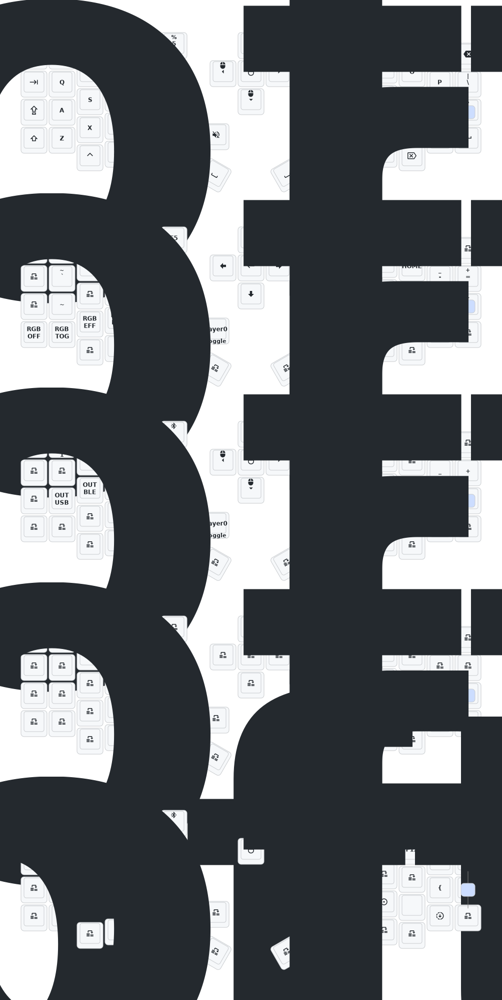

# Sofle

- [中文](README.md)
- [English](README_EN.md)
- [한국어](README_KR.md)

## 업데이트 목록

- **2024/12/21**
  1. **zmk-studio 지원 추가**: 왼쪽 키보드만 펌웨어를 새로고침하면 즉시 사용할 수 있습니다.
- **2024/10/24**
  1. 전원 공급 모드 수정으로 **소비 전력 감소**.
  2. **RGB 전원 자동 차단 기능** 수정.
- **2025/03/30**
  1. 취침 모드(Sleep mode) 진입 시간 1시간으로 연장, 디바운스(Debounce) 시간 추가, 취침 후 소비 전력 최적화.
- **2025/08/22**
  1. **Soft Off 기능 업데이트**: `Q`, `S`, `Z` 키를 동시에 2초간 누르면 키보드가 **딥 슬립(Deep Sleep)** 상태로 진입하며, 키 입력으로는 깨울 수 없습니다. 휴대 시 유용하며, 다시 켜려면 **리셋(Reset) 스위치**를 한 번 누르십시오.
  2. **하우징 업데이트**: Sofle 및 Corne 로우 프로파일 버전의 케이스를 업데이트했습니다. 프레임과 하판을 두껍게 보강하였고, 리셋 스위치 홀을 조정하여 쉽게 누를 수 있도록 개선했습니다. 현재 경사 지지대가 포함된 케이스 설계를 구상 중입니다. PCB에 예약된 **확장 IO 인터페이스**가 있으니 활용해 보시기 바랍니다.
  3. **우측 화면 애니메이션 제거**: 오른쪽 키보드 스크린의 GIF 애니메이션을 제거하여 **소비 전력을 대폭 절감**했습니다.

> 만약 사용 중인 키보드가 2025년 8월 22일 이전에 업데이트되었다면, 최신 펌웨어를 설치해 주세요.

## 연락처

3D 프린팅용 모델 파일이 필요하거나 키보드에 이상 혹은 고장이 있을 경우, 아래 메일로 연락 부탁드립니다.
📧 **380465425@qq.com**

## Sofle 키맵

